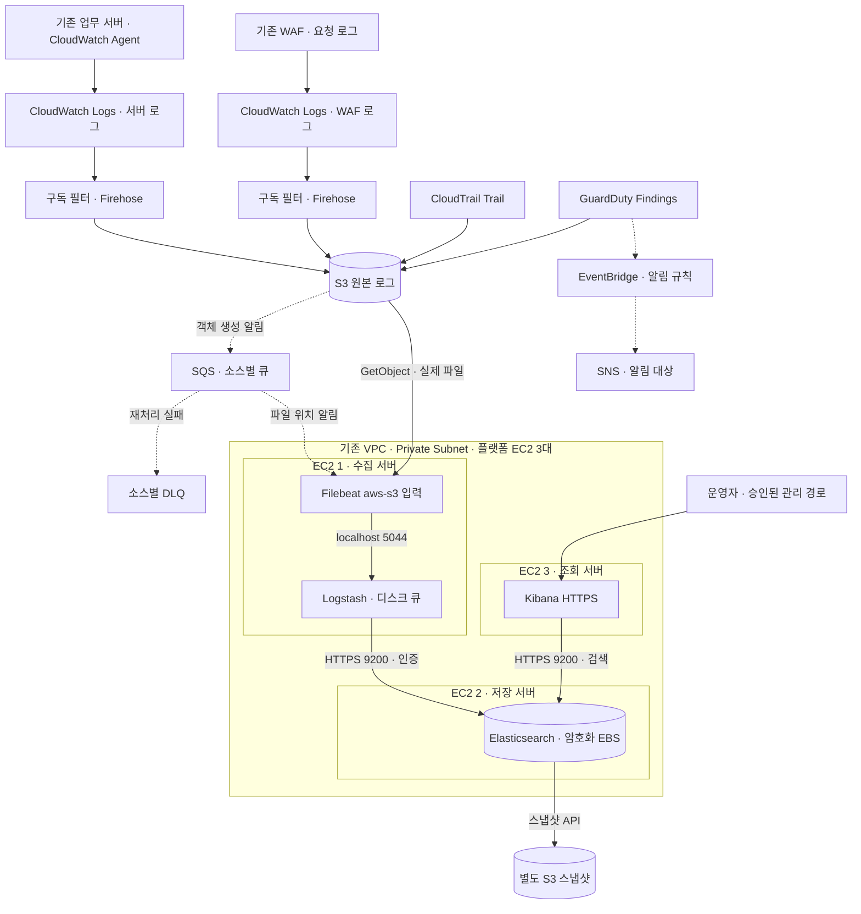

# 구성도와 서비스 역할

## 전체 데이터 경로

S3·SQS·Firehose 등의 서비스는 EC2 private subnet 안에 배치되는 프로세스가 아니다. EC2가 네트워크 경로와 IAM 권한을 이용해 서비스 API에 접근한다. S3 → SQS → Filebeat의 점선은 로그 본문 전송이 아니라 객체 알림 전달이다. Filebeat가 실제 로그 파일을 S3에서 별도로 가져온다.

CloudWatch Logs 구독 데이터의 envelope에는 `owner`, `logGroup`, `logStream`, `logEvents` 등이 들어 있다. Firehose에서는 압축을 해제하고 envelope 경계를 구분한 뒤 gzip 파일로 보관한다. `DataMessageExtraction`을 켜서 메타데이터를 지우지 않는다. 파일의 압축 방식과 JSON 경계는 Filebeat·Logstash 파서의 계약이며, 한쪽만 바꾸면 파싱 오류가 발생한다. [CloudWatch 구독 형식](https://docs.aws.amazon.com/AmazonCloudWatch/latest/logs/SubscriptionFilters.html), [Firehose 압축 해제](https://docs.aws.amazon.com/firehose/latest/dev/writing-with-cloudwatch-logs-decompression.html)

## 반드시 사용해야 하는가?

아래의 ‘필수’는 **이번 선택한 아키텍처를 그대로 구현할 때의 필수**를 뜻한다. 모든 기업이나 모든 AWS 로그 시스템에서 해당 제품을 반드시 사용해야 한다는 뜻은 아니다.

| 서비스·구성 | 이번 설계에서의 역할 | 필수성·사용 이유 | 대체·생략할 때 달라지는 점 |
|---|---|---|---|
| EC2 수집 서버 | Filebeat와 Logstash 실행 | 선택한 자체 운영 구조에서 필수 | 컨테이너·관리형 수집기로 대체 가능 |
| Filebeat `aws-s3` | SQS 알림을 읽고 S3 객체 다운로드 | SQS를 통한 수집과 향후 경쟁 소비를 위해 사용 | Logstash S3 polling만 쓰면 동일 작업의 분배를 별도 설계 |
| Logstash | 소스별 JSON 파싱, 시간·필드 정리, 실패 분리 | 사용자 요구인 ELK 처리 계층 | Elasticsearch ingest pipeline 등으로 일부 대체 가능 |
| Elasticsearch | 검색 가능한 인덱스 저장 | 선택한 ELK 구조에서 필수 | OpenSearch로 변경하면 제품·클라이언트·UI 호환성 검토 필요 |
| Kibana | 검색·대시보드 제공 | 선택한 ELK 사용자 인터페이스 | API 검색만 하면 UI는 생략 가능 |
| 원본 S3 | 원본 보관, 재처리 근거, EC2 장애와 저장 분리 | 이번 복구 전략의 핵심 | 원본을 버리면 잘못된 파싱을 되돌릴 수 없을 수 있음 |
| SQS | 객체 알림 보관, 수집기 중단 동안 작업 대기 | 이번 수집 경로의 핵심 | 소스별 polling과 재처리 상태 관리를 별도 구현 |
| DLQ | 반복 실패한 객체 알림 분리 | 정상 처리 지속과 실패 조사에 사용 | 생략하면 poison message 처리와 재시도 종료를 별도 설계 |
| CloudWatch Agent | 업무 서버 파일 로그를 CloudWatch Logs로 전송 | 해당 서버 로그를 이 방식으로 수집할 때 조건부 필수 | Filebeat 직접 전송 등으로 대체 가능 |
| CloudWatch Logs | 서버·WAF 로그 수신과 구독 원천 | 이번 두 소스의 선택한 중간 경로 | WAF는 S3 직접 전송 등의 다른 경로도 지원 |
| Firehose | CloudWatch 구독을 받아 S3로 묶음 전달 | 이번 CWL → S3 스트리밍 경로에서 사용 | Lambda 등으로 전달·버퍼·재시도를 직접 구현할 수 있음 |
| CloudTrail | AWS API·계정 활동 기록 | 해당 감사 로그를 확보하기 위한 소스 | 이벤트 선택 범위를 정해야 하며 모든 데이터 이벤트가 기본 기록되지는 않음 |
| WAF 로깅 | 보호한 웹 요청의 처리 결과 기록 | 해당 요청 로그가 필요할 때 필수 | Web ACL과 실제 연결 대상이 먼저 있어야 함 |
| GuardDuty | 분석된 보안 위협의 Findings 생성 | 해당 탐지 결과 수집의 원천 | VPC Flow·DNS 등 분석에 사용한 원시 로그의 대체물이 아님 |
| KMS | 원본·배포용 S3 암호화와 서비스 전달 권한 통제 | GuardDuty S3 내보내기에 필요; 스냅샷 버킷은 SSE-S3 사용 | S3 기본 암호화만으로 GuardDuty export 요구를 대체하지 않음 |
| IAM 역할·정책 | 서비스·EC2·운영자의 허용 작업 분리 | 인증·최소 권한에 필수 | 액세스키를 설정 파일에 넣는 방식은 사용하지 않음 |
| SSM Session Manager | 공개 SSH 없이 관리·터널 접속 | 이번 관리 경로의 기본 | VPN·배스천 등 승인된 다른 관리 경로로 대체 가능 |
| S3 gateway endpoint | EC2 → S3의 private 경로 | 기존 endpoint가 있으면 재사용; 비용·경로 개선 선택 사항 | 없으면 NAT·프록시 등 경로와 비용 확인 |
| 스냅샷 S3 | Elasticsearch native snapshot 저장 | 저장된 인덱스 복구 검증에 사용 | 원본 재색인은 가능하지만 클러스터 설정·색인을 동일하게 복원하는 것과 다름 |
| 배포용 S3 | 역할별 인증서·설정 묶음 전달 | 이 가이드의 안전한 설치 파일 전달 방식 | 기존 안전한 배포 도구로 대체 가능; CA 비밀키는 업로드 금지 |
| EventBridge + SNS | ELK와 독립적인 GuardDuty 알림 | 알림 검증용 선택 기능 | 저장·검색만 할 때 생략 가능; 실제 구독 대상 연결은 별도 |
| Terraform | 자원 관계·변경 계획·재현성 관리 | 이번 제공된 구축 자동화 도구 | 콘솔로 구축할 수 있지만 같은 자원을 두 경로에서 중복 생성하지 않음 |
| Lambda | 이 설계에서는 사용하지 않음 | 첫 구축에 필수 아님 | 로그 삭제 기준이 검증된 후 필요한 경우에만 도입 |

Filebeat의 S3 입력은 SQS 알림 경로를 권장하며, 동일 큐를 여러 수집기가 처리할 수 있다. 전송은 중복 가능성을 포함하므로 이벤트 ID와 목적지 인덱스 범위를 함께 정한다. [Elastic S3 입력](https://www.elastic.co/docs/reference/beats/filebeat/filebeat-input-aws-s3)

## 통신과 권한의 경계

| 발신 | 수신 | 허용할 통신 | 인증·제한 |
|---|---|---|---|
| Filebeat | 같은 EC2의 Logstash | loopback TCP 5044 | 외부 SG 인바운드로 공개하지 않음 |
| 수집 EC2 | Elasticsearch EC2 | TCP 9200 / HTTPS | 수집 SG만 허용, CA 검증, 전용 writer 자격 |
| Kibana EC2 | Elasticsearch EC2 | TCP 9200 / HTTPS | Kibana SG만 허용, 서비스 계정 인증 |
| 운영자 | Kibana | 관리 터널 → HTTPS 5601 | 사용자 로그인, 인증서 확인 |
| EC2 각 역할 | AWS API | TCP 443 | instance profile, IAM·KMS·bucket/queue policy |
| EC2 | Elastic·Ubuntu 배포 저장소 | HTTPS 및 구성한 패키지 저장소 경로 | NAT·프록시·사내 미러 중 선택 |
| AWS 로그 서비스 | 원본 S3 | 서비스 전달 | 해당 서비스 principal·source account·source ARN 제한 |

SG는 접속할 수 있는 네트워크 경계를 정하고, IAM은 수행할 수 있는 AWS API 작업을 정한다. 하나만 설정해 다른 하나를 대체할 수 없다. S3 endpoint를 새로 만드는 경우 기존 route table association과 endpoint policy가 이 패키지의 버킷을 허용하는지도 확인한다.

## 원본과 가공본의 보관 원칙

처음에는 CloudTrail, WAF, 서버 로그, GuardDuty Findings를 원본 저장소에 기록한다. Elasticsearch에는 파싱된 개별 이벤트를 넣는다. Logstash에서 `drop`한 이벤트도 원본 S3에서는 lifecycle 만료 전까지 유지된다. 따라서 이 단계의 필터링은 주로 Elasticsearch 색인량을 줄이며, S3 원본 저장료를 줄이지 않는다.

원본 저장소에 새 목적지 객체를 다시 쓰는 방식으로 재처리하면 자신이 만든 객체를 재수집하는 순환이 발생할 수 있다. 재처리 입력, 스냅샷, 설치 파일은 원본 알림 prefix와 분리한다. 원본에 Object Lock을 적용할 때는 보관 기간·모드·변경 권한을 먼저 결정한다. 이 검증용 Terraform은 장기 보관 잠금을 임의로 활성화하지 않는다.

## 현재 한계

Elasticsearch 한 대가 중단되면 검색과 색인이 중단된다. 복제본을 0으로 둔 상태에서 `green`이라는 이유만으로 데이터 이중화가 된 것은 아니다. Logstash 디스크 큐도 디스크의 영구 손실을 해결하지 않는다. 이번 단계에서는 S3 원본 재처리와 스냅샷 복원으로 복구 가능성을 검증한다. [단일 노드 제한](https://www.elastic.co/docs/deploy-manage/production-guidance/availability-and-resilience/resilience-in-small-clusters), [디스크 큐 제한](https://www.elastic.co/docs/reference/logstash/persistent-queues)
